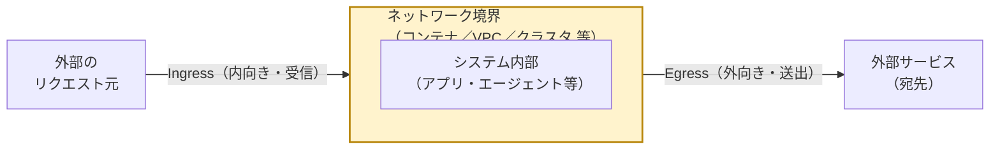

# 6. 用語集

Crystal Intelligence を理解する上で登場する主要な用語を整理します。
各用語について「Crystal Intelligenceの文脈での意味」と「一般的な技術用語としての意味」を
分けて記載し、混同を避けられるようにしています。

## Frontier

- **Crystal Intelligenceの文脈**: Crystal Intelligenceの基盤となる、OpenAIのエンタープライズ向け
  AIエージェントプラットフォームの名称（2026年2月5日発表）。
- **補足**: 一般名詞としての「フロンティア（最先端）」と、OpenAIの固有プロダクト名としての
  「Frontier」を混同しないよう注意。プレスリリースのタイトルにも明記されている固有名詞。
- **詳細**: 体系的な解説は [03-frontier-platform.md](03-frontier-platform.md) を参照。

## Business Context

- **Frontierの文脈**: CRM・ERP・データウェアハウスなど、企業内の複数システムを連携させ、
  AIエージェントが人間と同じ情報にアクセスできるようにするFrontierの機能領域。
  時間の経過とともに「組織としての記憶（institutional memory）」を蓄積していく設計とされる。

## Agent Execution

- **Frontierの文脈**: モデルの推論能力を実際の業務状況に適用し、複数のエージェントが並行して
  複雑なタスクをワークフロー・環境をまたいで遂行するためのFrontierの実行機能領域。

## Evaluation and Optimization

- **Frontierの文脈**: エージェントの成果を継続的に評価し、人間のフィードバックをもとに
  改善していくFrontierの機能領域。情報源によっては「Security & Governance」までを含めた
  3本柱として説明されることもあれば、これを独立した4つ目の機能として説明することもあり、
  表現に揺れがある。詳細は [03-frontier-platform.md](03-frontier-platform.md) 3.2節(3)を参照。

## Enterprise Frontier Program

- **Frontierの文脈**: "The OpenAI Deployment Company" 所属のFDE（Forward Deployed Engineer）が
  企業チームとペアを組み、アーキテクチャ設計・ガバナンス実装・本番運用までを伴走支援する
  OpenAI側の導入支援プログラム。詳細は [03-frontier-platform.md](03-frontier-platform.md) 3.4節を参照。

## Task Memory

- **Frontierの文脈**: 単一のエージェントタスクの実行中に記録される、中間推論・ツール呼び出し
  結果・人間のフィードバックなどの短期的なメモリ。詳細は [04-long-term-memory-deep-dive.md](04-long-term-memory-deep-dive.md) を参照。

## Organizational Memory

- **Frontierの文脈**: タスクやエージェントをまたいで共有される知識ベース。ビジネスルールや
  過去の意思決定記録などを蓄積する、Crystal Intelligenceの「長期記憶」に最も近い概念。
  詳細は [04-long-term-memory-deep-dive.md](04-long-term-memory-deep-dive.md) を参照。

## Learning Loop

- **Frontierの文脈**: エージェントが人間のフィードバック（承認・修正・却下）をもとに
  継続的に振る舞いを調整する仕組み。学習は企業のデータ境界内で完結し、他社に漏れない設計とされる。
  詳細は [04-long-term-memory-deep-dive.md](04-long-term-memory-deep-dive.md) を参照。

## o1シリーズ

- **Crystal Intelligenceの文脈**: Crystal Intelligenceのベースモデルの1つとして名指しされている、
  OpenAIの推論（reasoning）に優れたLLMシリーズ。
- **一般的な意味**: OpenAIが公開している、応答前に内部で段階的な推論過程を経ることで
  複雑な問題解決能力を高めたモデル群の呼称。

## ナレッジグラフ（Knowledge Graph）

- **一般的な意味**: 実体（人・製品・データセット等）をノード、実体間の関係をエッジとして表現する
  グラフ構造のデータモデル。検索精度向上やAIの推論強化に用いられる。
- **Crystal Intelligence／Frontierの文脈**: 公式資料での言及は**一切なし**。
  第三者のデータ管理専門家が「Frontierが真に機能するには企業側で用意すべき」と提言している
  概念であり、Crystal Intelligenceが実際に採用しているかは非公開・不明。
  詳細は [04-long-term-memory-deep-dive.md](04-long-term-memory-deep-dive.md) 4.7節を参照。

## コンテキストグラフ（Context Graph）

- **一般的な意味**: 静的なナレッジグラフに、時間軸・ポリシー・意思決定履歴を加えた発展形。
  本番運用中のAIエージェントが陳腐化しないコンテキストを参照するための概念。
- 詳細は [04-long-term-memory-deep-dive.md](04-long-term-memory-deep-dive.md) 4.7節を参照。

## SB OAI Japan

- ソフトバンクとOpenAIの合弁会社。Crystal Intelligenceの提供主体。
- 「SB」=ソフトバンク、「OAI」=OpenAI、の頭文字を組み合わせた社名と推測される（※推定）。

## RAG（Retrieval-Augmented Generation／検索拡張生成）

- **一般的な意味**: LLMが回答を生成する際、外部のデータソース（社内文書やDBなど）を検索し、
  その結果を根拠として回答に組み込む技術手法。
- **Crystal Intelligenceの文脈**: 「安全なRAGと長期記憶」という表現で言及されている。
  ただし「RAG」という用語自体が公式資料に明記されているわけではなく、
  本教材では説明の便宜上、一般的な技術用語を用いて解説を補っている（※教材側の整理表現）。

## 長期記憶（Long-term Memory）

- **Crystal Intelligenceの文脈**: 単発のやり取りで終わらず、企業固有の情報・文脈を
  蓄積し続け、継続的な業務支援に活用するという設計思想を指す表現。
  Frontier側の Organizational Memory / Learning Loop に対応すると考えられる。
- **技術的な裏付け**: 概念モデル（何を記憶するか）は複数の技術解説記事で説明されているが、
  具体的な実装方式（メタデータ形式、ストレージ、永続化の仕組みなど）は非公開。
  詳細は [04-long-term-memory-deep-dive.md](04-long-term-memory-deep-dive.md) を参照。

## 自律型AIエージェント（Autonomous AI Agent）

- **一般的な意味**: 与えられた目標に対して、人間の逐次的な指示なしに、
  自ら計画・実行・検証のループを回してタスクを遂行するAIシステム。
- **Crystal Intelligenceの文脈**: 財務、文書作成、顧客対応などの業務プロセスを
  自律的に遂行する「複数のエージェントの連携」として説明されている。

## FDE（Forward Deployed Engineer）

- **Crystal Intelligenceの文脈**: OpenAIおよびソフトバンクのエンジニアが、
  導入企業に直接入り込み、データ統合・セキュリティ設計・実装までを一気通貫で支援する役割。
- **一般的な意味**: Palantir社が確立したことで知られる職種概念で、汎用的なプラットフォームを
  個別顧客の業務要件に合わせてカスタマイズ実装するエンジニアのこと（※業界一般知識としての補足）。

## Egress（イーグレス）／Ingress（イングレス）

- **一般的な意味**: ネットワーキングの基本用語。**Egress**はシステムやネットワークの境界から
  **外側へ出ていく**通信（送出）を指し、**Ingress**はその逆に境界の**内側へ入ってくる**通信（受信）を
  指す。対義語のペアとして扱われることが多い。
- **注意（Kubernetes固有ではない）**: AWS（VPCのegressルール）、GCP、Azure、Kubernetes
  （`NetworkPolicy`の`egress`ルール、Istioの`egress gateway`）など、多くのクラウド／インフラ環境で
  共通して使われる一般的なネットワーキング概念であり、Kubernetes固有の用語ではない。ただし
  Kubernetesでは「Ingress」がリソース種別（`Ingress`オブジェクト）としても知られているため、
  Kubernetes経由でこの語に触れる人が多いと考えられる（※一般的な技術知識としての補足）。

- **本教材内での使用箇所**: [09-anthropic-comparison.md](09-anthropic-comparison.md) 9.3.3節で、
  Anthropic Managed Agentsのサンドボックス（コンテナ）境界から外部サービスへリクエストが
  出ていく瞬間（egress）に、Anthropic側のプロキシが実際の認証情報を注入する仕組みを説明する際に
  用いている。「サンドボックス内部には認証情報を渡さず、境界を越える瞬間にのみ実値と結合する」
  という設計を理解する上でのキーワードとなる。

## テナント分離／データ隔離

- **Crystal Intelligenceの文脈**: 「他社にデータが漏洩・再利用されない仕組み」として
  言及されている、企業ごとにデータを安全に隔離する設計。
- **一般的な意味**: マルチテナントのSaaS/AIサービスにおいて、顧客ごとのデータを
  論理的・物理的に分離し、横断的なアクセスやモデル学習への流用を防ぐアーキテクチャパターン。

---

用語の理解を踏まえた上で、まだ公開されていない・不明な技術領域について
[07-open-questions.md](07-open-questions.md) で整理します。
