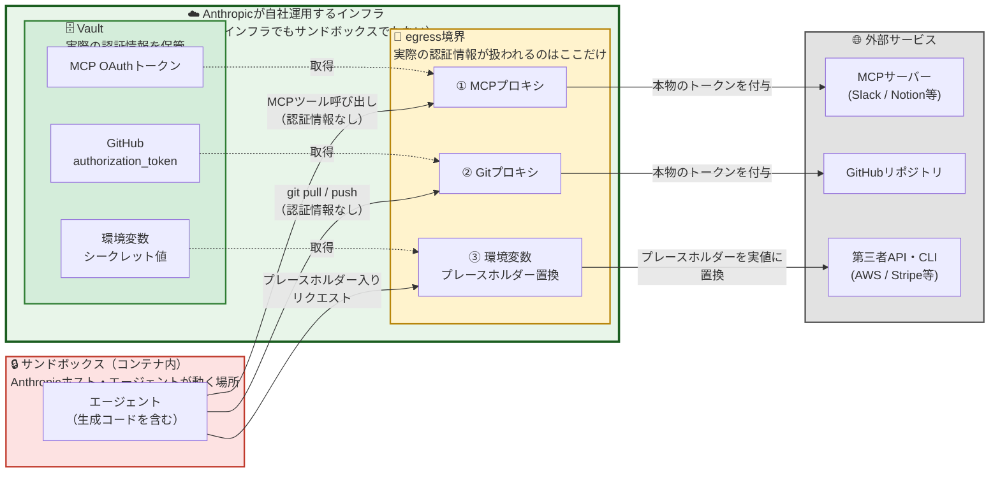
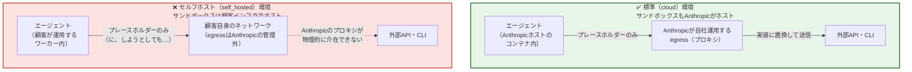
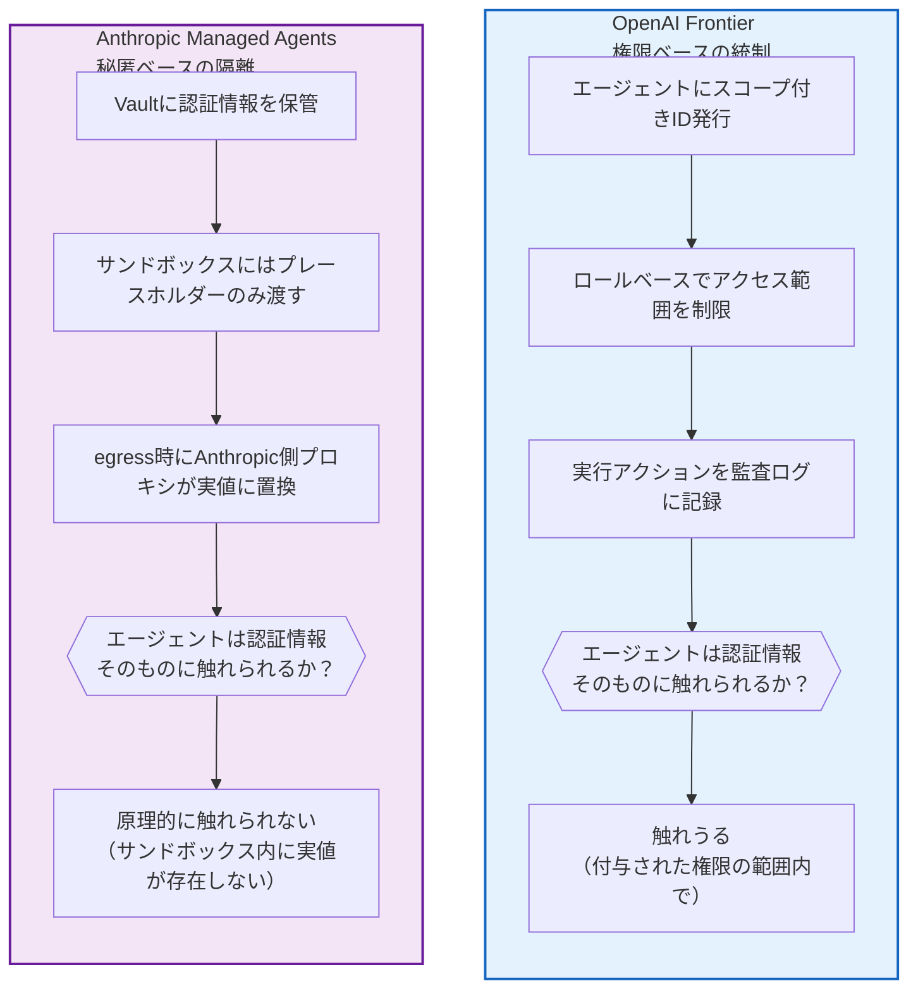

# 1. 比較：Anthropic陣営の等価プロダクト

本章は、Crystal Intelligence／Frontier（OpenAI陣営）の理解を補助する目的で、
競合であるAnthropic社の等価プロダクトを整理する補足章です。01〜08章の本編とは異なり、
Crystal Intelligence自体の一次情報ではなく、**Anthropic公式APIドキュメントを主な情報源**として
構成しています。他社比較を通じて「Frontierというアプローチが業界内でどう位置付けられるか」を
相対的に理解することを目的とします。

## 1.1 本章の情報源の性質

本章の記述は、以下の情報源に基づきます。

1. **Anthropic公式APIドキュメント**（Claude API／Claude Code に同梱される開発者向け技術資料。
   2026年6月24日時点でキャッシュされた内容に基づく。一次情報に相当）
2. **Web検索による報道**（OpenAI Frontierの発表記事・報道。03章の情報源と重複するため詳細は
   [03-frontier-platform.md](../core/03-frontier-platform.md) 3.7節を参照）

Anthropic側の情報は、SB OAI Japanのような日本語プレスリリースの形では存在せず、
開発者向け技術文書として公開されている点がCrystal Intelligence関連情報源と性質が異なります。
記述の中で本教材側の解釈・整理を加えた箇所には、他章同様「※推定」「※教材側の整理表現」と明記します。

## 1.2 Claude Fable 5 — Anthropicのフロンティアモデル

まず、基盤モデルの水準でOpenAIの「フロンティアモデル」に相当する存在を確認します。

- **正式名称**: Claude Fable 5（モデルID: `claude-fable-5`）
- **位置付け**: Anthropicが「最も高性能な一般公開モデル」と位置付ける、最上位モデル。
  最も要求の厳しい推論タスクと、長時間にわたる自律的なエージェント作業（long-horizon agentic work）
  向けに設計されているとされる
- **コンテキストウィンドウ**: 100万トークン（デフォルトかつ最大）
- **最大出力**: 128,000トークン
- **料金**: 入力 $10.00 / 出力 $50.00（100万トークンあたり）。Anthropicの他モデル（Opus系）より高価格帯
- **Thinking（思考過程）の扱い**:
  - 常時有効（オフにできない設計。明示的な無効化指定は仕様上エラーになる）
  - 生の思考過程（raw chain of thought）自体は外部に一切返されない設計
  - 要約表示のオプトインは可能だが、デフォルトでは思考ブロックの中身は空文字として返る
- **安全性判定**: サイバーセキュリティ・生物学関連など高リスク領域のリクエストに対し、
  分類器が拒否判定を行う仕組みが用意されている（`stop_reason: "refusal"`）。この拒否時に
  別モデルへ自動フォールバックする仕組みも用意されている
- **データ保持要件**: 30日間のデータ保持が必須（ゼロデータ保持環境では利用不可）
- **同格プロダクト**: Claude Mythos 5（`claude-mythos-5`）という同一仕様のモデルが、
  「Project Glasswing」という限定プログラム参加者向けに提供されている
  （※Crystal Intelligenceのような特定パートナー限定プロダクトと構造的に類似する点として、
  本教材側で比較の観点から言及。詳細な提供条件は非公開）

**理解のポイント**: Claude Fable 5は、あくまで**単体の基盤モデル**であり、Frontierのような
「エンタープライズ向けエージェント運用基盤」そのものではありません。Frontierと直接比較すべき
対象はモデルではなく、次節で扱うAnthropicのプラットフォーム型プロダクトです。

## 1.3 Anthropic Managed Agents — Frontierに相当するプラットフォーム

Frontierの「企業が安全に本番運用できるAIエージェントを構築・展開・管理する基盤」という
位置付け（[03-frontier-platform.md](../core/03-frontier-platform.md) 3.1節）に対応するAnthropic側のプロダクトが
**Managed Agents**（Claude Managed Agents、通称CMA）です。

### 1.3.1 基本構造

- **提供形態**: ベータ版として提供されているAPI群（`/v1/agents`、`/v1/sessions`、
  `/v1/environments` 等）
- **中核概念**: Anthropicが「エージェントループ」と「セッションごとのサンドボックス実行環境」の
  両方をホストする、という点がFrontierとの構造的な共通点
- **必須の作成順序**: Agent（モデル・システムプロンプト・ツール・MCPサーバー・スキルを持つ、
  永続化・バージョン管理された設定オブジェクト）を先に作成し、それを参照する形でSession
  （実際の実行インスタンス）を都度作成する、という二段構成

### 1.3.2 主要コンポーネントとFrontierとの対応

| Managed Agentsの構成要素           | 機能概要                                                                                                      | Frontier側の近い概念（[03-frontier-platform.md](../core/03-frontier-platform.md) 3.2節） |
| ---------------------------------- | ------------------------------------------------------------------------------------------------------------- | ------------------------------------------------------------------------------- |
| Agent                              | モデル・システムプロンプト・ツール・MCPサーバー・スキルを持つ永続設定                                         | Agent Execution（実行エンジンの設定単位）                                       |
| Session                            | Agentを参照して実行される、実際のタスク処理インスタンス。専用コンテナ上でbash・ファイル操作・コード実行が走る | Agent Execution（実行環境）                                                     |
| Environment                        | コンテナのプロビジョニング設定（Anthropicホスト型 or 自社インフラでのセルフホスト型）                         | Agent Execution（ローカル／企業クラウド／OpenAIホストの3種の実行環境）          |
| Vault                              | MCPサーバーの認証情報やAPIキーを安全に管理する仕組み。サンドボックス内には平文で露出しない設計                | Security & Governance（権限・アイデンティティ管理）                             |
| Memory Store                       | セッションをまたいで永続化する記憶領域（テキストドキュメント形式）                                            | Business Context（組織としての記憶／Organizational Memory）                     |
| Multiagent（コーディネーター機能） | 複数エージェントが1セッション内で連携・委任し合う仕組み                                                       | Agent Execution（複数エージェントの並行実行）                                   |
| Deployments（スケジュール実行）    | cronスケジュールでセッションを自動起動する仕組み                                                              | 明記なし（※Frontier側の対応機能は本教材調査時点で未確認）                      |
| Outcome（ルーブリック評価）        | 「完了」の判定基準をルーブリック形式で与え、基準を満たすまで反復させる仕組み                                  | Evaluation and Optimization（成果の継続評価）                                   |

### 1.3.3 認証・セキュリティモデル

Vaultに保存された認証情報（MCPサーバーのOAuthトークン、APIキー等）は、**実行コンテナ（サンドボックス）
の中には一切渡されない**という設計が特徴です。その代わり、リクエストがサンドボックスの外に出る瞬間
（**egress**。ネットワーク境界から外部へ出ていく通信を指す一般用語。詳細は
[06-glossary.md](../reference/02-glossary.md) の「Egress／Ingress」の項を参照）に、**Anthropicが自社で運用する
インフラ上のプロキシ**が実際の認証情報を注入します。ドキュメント上もこの仕組みは
"Anthropic-side proxy"（Anthropic側プロキシ）、"Anthropic-managed egress"（Anthropicが管理する
egress）と明記されており、顧客のインフラでもエージェントのサンドボックスでもなく、
**Anthropic自身が物理的に管理するネットワーク境界**で認証情報の実値と結合される点が
この設計の核心です。

#### アーキテクチャ図

**読み方**: 左（赤）のサンドボックス内から見える情報は、常に「何もない」か「プレースホルダー」のみです。
本物の認証情報は、**太い緑枠で囲んだ「Anthropicが自社運用するインフラ」の内部**（egress境界＋Vault）
でのみ実際のリクエストに合流します。この緑枠は顧客のインフラでもエージェントのサンドボックスでもなく、
Anthropicが物理的に管理・運用するネットワーク境界であるという点が、次段落以降の議論の前提です。
エージェントが生成したコードがどれだけサンドボックス内を探索しても、シークレットの実値には
到達できない、という構造です。

#### 3種類の注入経路

| #  | 経路                                   | 対象                                                                             | 動作                                                                                                                                                                              |
| -- | -------------------------------------- | -------------------------------------------------------------------------------- | --------------------------------------------------------------------------------------------------------------------------------------------------------------------------------- |
| ① | **MCPプロキシ**                  | エージェントがMCPサーバー（Slack、Notion等）のツールを呼ぶとき                   | リクエストがAnthropic側プロキシを経由し、そこでVaultからOAuthトークン等を取得してリクエストに付与してから実サーバーへ送る                                                         |
| ② | **Gitプロキシ**                  | 接続されたGitHubリポジトリへの`git pull`/`git push`、GitHub REST API呼び出し | 同様にプロキシ経由で、`github_repository`リソースの`authorization_token`をその場で注入する                                                                                    |
| ③ | **環境変数クレデンシャルの置換** | エージェントが`bash`ツールでCLIやAPIを直接叩くとき（AWS CLI、Stripe API等）    | サンドボックス内には**不透明なプレースホルダー文字列**しか見えない。リクエストが許可済みホスト（`allowed_hosts`）へ送出される瞬間に、本物のシークレット値へ置き換えられる |

#### なぜこの設計なのか

これは**プロンプトインジェクション対策としてのセキュリティ境界**です。エージェント自身が生成・
実行するコード（悪意ある指示に汚染されている可能性がある）が、サンドボックス内のどこを探しても
シークレットの実値を読み取れないようにしています。仮にエージェントが「環境変数を全部printせよ」と
誘導されても、見えるのはプレースホルダーだけで、実際のAPIキーは漏れません。

#### 補足：置換範囲の制約

- 環境変数クレデンシャルには`injection_location`という設定があり、置換対象を**リクエストヘッダーのみ**か
  **ボディも含む**かを選択できる
- **URLパス**に埋め込まれたシークレット（例：SlackのIncoming Webhook URLのようなパス型トークン）は
  置換対象外。そのためこの方式では扱えず、ヘッダー型認証（Bot Tokenなど）への切り替えが必要になる

#### 反証：セルフホスト環境で何が起きるか

「プロキシがAnthropic自社インフラ上で動いている」という主張を裏付ける事実として、
Managed Agentsには`Environment`の`config.type`を`"self_hosted"`に設定し、**ツール実行環境
（サンドボックス）自体を顧客が自前のインフラ上で運用する**選択肢があります。この場合、
エージェントの意思決定ループ自体はAnthropic側に残りますが、bashコマンド等の実行場所が
顧客インフラに移るため、③の環境変数クレデンシャル置換だけが機能しなくなります。

公式ドキュメントでも、セルフホスト環境における環境変数クレデンシャルの扱いは
"**Not yet supported — egress is yours, so there's nowhere to substitute the secret**"
（非対応。egressは顧客のものであり、Anthropicがシークレットを置換する場所が存在しないため）
と明記されている。「顧客がegressを握っている＝Anthropicにはそこに介在する権限がない」ことが
非対応の直接の理由として説明されており、これは裏を返せば、**標準（cloud）環境のegressは
Anthropic自身が管理しているからこそ、この置換の仕組みが成立している**ことの明確な反証になっている
（この項自体は公式ドキュメントの記述に基づく事実であり、※推定ではない）。

なお、①MCPプロキシ・②Gitプロキシについては、セルフホスト環境での対応状況が公式ドキュメント上
明示的に記載されておらず、本教材調査時点では**非公開・現時点では不明**として扱う。上記の反証は
あくまで③環境変数クレデンシャルの置換に限定される点に注意（※教材側の整理表現）。

#### Frontierとの設計思想の比較

Frontier側の「スコープ付きエージェントID」「監査ログ」「ロールベースアクセス制御」
（[03-frontier-platform.md](../core/03-frontier-platform.md) 3.2節(4)）とは、目的（企業システムを安全に
エージェントに使わせる）は共通していますが、**統制の軸が異なります**（※教材側の整理表現）。

**まとめ**: Frontierは「誰が・何に・どこまでアクセスできるか」という**権限（permission）の粒度**で
統制する設計思想である一方、Managed Agentsは「そもそも認証情報の実体をエージェントに見せない」という
**秘匿（secrecy）そのもの**を境界とする設計思想です。前者は権限設定を誤ると露出リスクが残りますが、
後者はエージェント実行環境自体が認証情報を物理的に保持しないため、設定ミスに対する耐性が構造的に
高いと考えられます（※教材側の考察。実際の脆弱性・運用実績の比較検証結果ではない点に留意）。

## 1.4 Frontier と Managed Agents の比較表

| 観点               | OpenAI Frontier                                                                                    | Anthropic Managed Agents                                                                            |
| ------------------ | -------------------------------------------------------------------------------------------------- | --------------------------------------------------------------------------------------------------- |
| 発表・提供状況     | 2026年2月5日発表。限定顧客への提供から開始し、順次拡大中                                           | ベータ版として開発者向けに公開中                                                                    |
| 対象顧客           | Fortune 500規模の大企業が中心（Intuit、State Farm、Uber等）                                        | API開発者・エンタープライズ双方（企業名を冠した早期顧客の公表は本教材調査時点で未確認）             |
| 主要コンポーネント | Business Context / Agent Execution / Evaluation and Optimization / Security & Governance           | Agent / Session / Environment / Vault / Memory Store                                                |
| 記憶の仕組み       | Business Context（組織横断のセマンティックレイヤー、Task/Organizational Memory）                   | Memory Store（ワークスペース単位で永続化するテキストドキュメント群。バージョン管理・監査ログ付き）  |
| マルチベンダー対応 | OpenAI以外（Google、Microsoft、Anthropic等）のエージェントも横断的に受け入れる設計と説明されている | Anthropicモデル・MCPサーバーを中心とした構成（他社モデルの統合は本教材調査時点で未確認）            |
| 導入支援           | Enterprise Frontier ProgramによるFDE（Forward Deployed Engineer）伴走支援                          | ドキュメント・CLI（`ant`）・SDK中心のセルフサーブ型（人的伴走支援の有無は本教材調査時点で未確認） |
| スケジュール実行   | 明記なし（本教材調査時点で未確認）                                                                 | Deployments機能としてcronスケジュール実行が明示的に用意されている                                   |

**まとめると**: 両者とも「単体モデルの提供」ではなく「複数エージェントを企業システムに統合し、
安全に運用し続けるための基盤（インフラ＋管理レイヤー）」という設計思想を共有している点が
最大の共通点です（[03-frontier-platform.md](../core/03-frontier-platform.md) 3.1節の定義を参照）。
相違点としては、Frontierが「企業導入プロジェクト」として大企業向けに手厚い伴走支援を伴う形で
展開されているのに対し、Managed Agentsは現時点でAPI・開発者向けのセルフサーブ色が強い、
という提供形態の違いが挙げられます（※本教材側の比較を通じた整理）。

## 1.5 情報源

| 情報源                                                      | URL                                                                                                    | 性質                                                                                  |
| ----------------------------------------------------------- | ------------------------------------------------------------------------------------------------------ | ------------------------------------------------------------------------------------- |
| Anthropic公式APIドキュメント（Claude API / Managed Agents） | 非公開URL（Claude Code同梱の開発者向け技術資料。2026-06-24時点キャッシュ）                             | 一次・公式相当（開発者向け技術仕様）                                                  |
| Introducing OpenAI Frontier                                 | https://openai.com/index/introducing-openai-frontier/                                                  | 一次・公式（発表記事、[03-frontier-platform.md](../core/03-frontier-platform.md) 3.7節と重複） |
| CNBC報道                                                    | https://www.cnbc.com/2026/02/05/open-ai-frontier-enterprise-customers.html                             | 二次・報道                                                                            |
| TechCrunch報道                                              | https://techcrunch.com/2026/02/05/openai-launches-a-way-for-enterprises-to-build-and-manage-ai-agents/ | 二次・報道                                                                            |
| OpenAI Frontier製品ページ                                   | https://openai.com/business/frontier/                                                                  | 一次・公式（製品ページ）                                                              |

> **読み方の注意**: Anthropic側の情報源はAPI仕様書という性質上、公開URLでの直接引用が難しい
> （開発者ツールに同梱される技術文書のため）。数値・仕様（料金、コンテキストウィンドウ等）は
> 執筆時点（2026年7月）のものであり、両社とも頻繁にアップデートが行われる領域のため、
> 最新情報は各社の公式開発者ドキュメントで確認することを推奨します。

## 1.6 本章のまとめ

- Anthropicにおける「フロンティアモデル」に相当する存在は**Claude Fable 5**（単体モデル）
- Frontierという「企業向けエージェント運用基盤」に相当する存在は**Managed Agents**（プラットフォーム）
- 両者は目的（企業システムへのエージェント統合・安全な本番運用）を共有しつつ、
  提供形態（大企業向け伴走支援 vs 開発者向けセルフサーブ）に違いが見られる
- Crystal Intelligence自体との直接比較（日本市場向けパッケージソリューションとしての競合）は
  本教材調査時点で確認できる情報源がなく、**非公開・現時点では不明**として扱う

---

本章はAnthropic陣営との比較を通じた補足章です。Crystal Intelligence本編の未解明領域については
[07-open-questions.md](../reference/03-open-questions.md) を参照してください。
