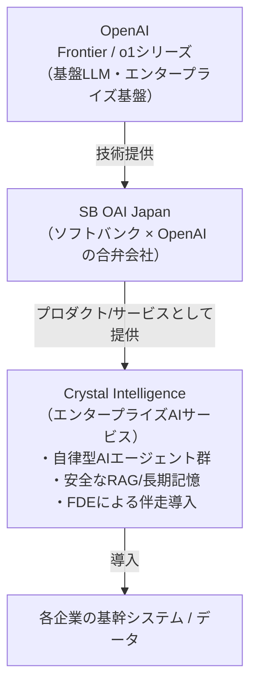

# 1. 概要：Crystal Intelligenceとは

## 1.1 一言で言うと

**Crystal Intelligence（クリスタル・インテリジェンス）** は、ソフトバンクと OpenAI が設立した
合弁会社 **SB OAI Japan** が提供する、日本企業向けのエンタープライズAIサービスです。

一般消費者向けのチャットAIとは異なり、以下の特徴を持ちます。

- 導入対象は**個々の企業**（B2B、しかもエンタープライズ規模）
- 各社の**基幹システム・社内データと統合**した形で構築される
- **単一のAIモデル呼び出し**ではなく、複数のAIエージェントが協調して業務プロセスを遂行する
  システムとして設計されている
- 技術ドキュメントの提供だけでなく、**人（FDE: Forward Deployed Engineer）による導入支援**が
  セットになっている

## 1.2 事業主体：SB OAI Japan

- ソフトバンクグループと OpenAI の合弁会社
- 「日本市場向けにOpenAIのエンタープライズ技術を展開する」ことをミッションとする組織
- Crystal Intelligence は、この合弁会社が展開する最初の（あるいは中核となる）
  エンタープライズAIプロダクト／サービスブランドという位置付け

> **※注意**: SB OAI Japan と OpenAI 本体、ソフトバンク本体（ソフトバンク株式会社 /
> ソフトバンクグループ株式会社）は別法人です。技術解説がどの主体から発信されているかを
> 意識すると、情報の性質（公式一次情報か、パートナー企業による補足解説か）を区別しやすくなります。

## 1.3 なぜ「一般的なAPIプロダクト」と違う情報の探し方が必要なのか

通常のAI/クラウドプロダクト（OpenAI API、Azure OpenAI Serviceなど）であれば、

- 公開APIリファレンス
- 料金ページ
- 開発者向けドキュメントサイト
- （OSSであれば）GitHubリポジトリ

といった経路で技術仕様を確認できます。

Crystal Intelligence の場合、[07-open-questions.md](../reference/03-open-questions.md) で触れる通り、
これらに相当する**開発者向けの公開情報が存在しません**。これは、Crystal Intelligence が
「不特定多数の開発者が自由に呼び出すAPI」ではなく、「特定の企業向けに個別設計・個別導入される
サービス」であることの裏返しです。

そのため本教材では、情報源を「プレスリリース（事実の一次情報）」と
「Tech Blog/Insights（アーキテクチャの解説）」に区別しながら、体系的に整理していきます。
詳細は [05-key-sources.md](../reference/01-key-sources.md) を参照してください。

## 1.4 全体像の図解

次章では、この図の各要素（基盤モデル、RAG/長期記憶、マルチエージェント、FDE）を
分解して詳しく見ていきます。→ [02-technical-architecture.md](02-architecture.md)
